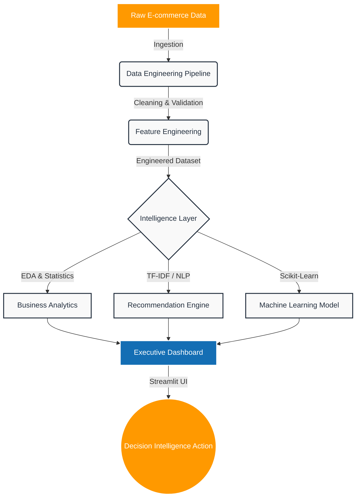

<div align="center">

# Amazon Product Intelligence Platform

**AI-Powered Product Analytics, Business Intelligence, Machine Learning & Executive Decision Intelligence Platform**

[](https://www.python.org/)
[](https://pandas.pydata.org/)
[](https://scikit-learn.org/)
[](https://plotly.com/)
[](https://streamlit.io/)
[](https://powerbi.microsoft.com/)
[](https://opensource.org/licenses/MIT)
[](https://github.com/yourusername/amazon-product-intelligence)

*Version 2.0.0 | Last Updated: August 2026*

---

<!-- Banner Image Placeholder -->


</div>

<br/>

## 📑 Table of Contents
<details>
<summary>Click to expand</summary>

1. [Executive Summary](#-executive-summary)
2. [Business Problem](#-business-problem)
3. [Solution Overview](#-solution-overview)
4. [Key Features](#-key-features)
5. [Project Architecture](#-project-architecture)
6. [Technology Stack](#-technology-stack)
7. [Folder Structure](#-folder-structure)
8. [Dataset Description](#-dataset-description)
9. [Data Engineering Pipeline](#-data-engineering-pipeline)
10. [Advanced Exploratory Data Analysis](#-advanced-exploratory-data-analysis)
11. [Feature Engineering](#-feature-engineering)
12. [Business Analytics](#-business-analytics)
13. [Statistical Analysis](#-statistical-analysis)
14. [Machine Learning](#-machine-learning)
15. [Recommendation Engine](#-recommendation-engine)
16. [Dashboard](#-dashboard)
17. [Streamlit Application](#-streamlit-application)
18. [Results](#-results)
19. [Performance](#-performance)
20. [Future Enhancements](#-future-enhancements)
21. [Installation](#-installation)
22. [Usage](#-usage)
23. [Sample Screenshots](#-sample-screenshots)
24. [Business Impact](#-business-impact)
25. [Resume Highlights](#-resume-highlights)
26. [Learning Outcomes](#-learning-outcomes)
27. [License](#-license)
28. [Author](#-author)

</details>

<br/>

---

## 🎯 Executive Summary

**Amazon Product Intelligence Platform** is an end-to-end Enterprise Product Intelligence Platform designed to transform raw e-commerce catalog data into actionable executive decision intelligence. 

In highly competitive e-commerce environments like Amazon, vast catalogs of products often suffer from misaligned pricing, suboptimal discounting strategies, and ignored customer feedback signals. The Amazon Product Intelligence Platform exists to solve the "data rich, information poor" dilemma. 

Targeted at **Product Managers, Pricing Analysts, and E-commerce Executives**, this platform integrates a robust data engineering pipeline, advanced statistical analysis, machine learning predictive modeling, and an intuitive Streamlit-based executive dashboard. The expected impact is a significant optimization in promotion spend, proactive mitigation of pricing risks, and a measurable increase in product visibility and conversion rates.

---

## 🛑 Business Problem

Managing a large-scale e-commerce portfolio presents several critical challenges:
- **Suboptimal Pricing Decisions:** Setting prices without understanding the intersection of customer trust, rating velocity, and market competitiveness leads to margin erosion.
- **Blind Discounting:** Aggressive discounting often fails to repair products with fundamental quality issues (reflected in low ratings) and only bleeds revenue.
- **Product Discovery Friction:** Customers struggle to find relevant items without sophisticated, content-aware recommendation engines.
- **Analysis Paralysis:** Executives are overwhelmed by granular data and lack a unified "health score" or automated triage system that explicitly tells them *what action to take*.

Companies need product intelligence to bridge the gap between raw analytical data and strategic business intervention.

---

## 💡 Solution Overview

The Amazon Product Intelligence Platform delivers a multifaceted approach to product intelligence:
- **Decision Intelligence:** Translates raw metrics into definitive, product-specific actions (e.g., "Taper 55% discount to capture margin on highly rated item").
- **Business Intelligence:** Interactive dashboards displaying critical KPIs, category performances, and pricing waterfalls.
- **Machine Learning:** A Random Forest classifier predicting the probability of a product becoming a "Top Tier" success based on engineered features.
- **Recommendation System:** A TF-IDF and Cosine Similarity-based engine for Amazon-style "similar product" discovery.
- **Analytics & Visualization:** Clean, enterprise-grade Plotly charts offering deep dives into multivariate distributions and market segments.

---

## ⭐ Key Features

### 🛠️ Data Engineering & Analytics
- **Automated Data Cleaning:** Robust handling of nulls, currency conversion (Rupees to float), and string manipulation.
- **Advanced EDA:** Deep univariate, bivariate, and multivariate analysis of pricing elasticity and category distribution.
- **Statistical Analysis:** Hypothesis testing and correlation matrices to prove the significance of discounting on sales volume.

### 🧠 Machine Learning & AI
- **Feature Engineering:** Creation of proprietary business metrics (e.g., Customer Trust Index, Business Priority Score).
- **Predictive Modeling:** ML pipeline utilizing Scikit-Learn to predict product success, including full hyperparameter tuning and model explainability (Feature Importance).
- **Content-Based Recommendation Engine:** NLP-driven product matching based on category and textual similarity.

### 📊 Executive Interface
- **Streamlit Web Application:** A beautifully designed, interactive UI tailored for executive presentations.
- **Automated Insight Generation:** Natural language generation of actionable insights based on real-time data filters.
- **Reporting:** Exportable JSON and CSV executive summaries.

---

## 🏗️ Project Architecture



---

## ⚙️ Technology Stack

| Category | Technologies |
|---|---|
| **Languages** | Python 3.10+, HTML5, CSS3 |
| **Data Engineering** | Pandas, NumPy, Regular Expressions |
| **Machine Learning** | Scikit-Learn, Joblib, SciPy |
| **NLP** | TF-IDF Vectorizer, Cosine Similarity |
| **Visualization** | Plotly Express, Plotly Graph Objects, Matplotlib, Seaborn |
| **Frontend Framework** | Streamlit |
| **Documentation & CI** | Markdown, Mermaid.js, Git, GitHub |

---

## 📁 Folder Structure

```text
amazon-product-intelligence/
│
├── app/                        # Streamlit web application files
│   ├── __init__.py
│   ├── charts.py               # Plotly chart generation functions
│   ├── components.py           # Reusable UI components (cards, metrics)
│   ├── streamlit_app.py        # Main Streamlit application entry point
│   └── styles.py               # Custom enterprise CSS injection
│
├── data/                       # Data storage (ignored in version control)
│   ├── raw/                    # Original, immutable data dumps
│   └── processed/              # Cleaned and feature-engineered datasets
│
├── docs/                       # Project documentation and assets
│   └── assets/                 # Screenshots and banner images
│
├── models/                     # Serialized machine learning models
│   └── product_success_random_forest.joblib
│
├── notebooks/                  # Jupyter notebooks for experimentation
│   └── exploratory_analysis.ipynb
│
├── reports/                    # Generated analytical reports
│   ├── executive_summary.json
│   └── pricing_opportunities.csv
│
├── src/                        # Core Python source code
│   ├── __init__.py
│   ├── analytics.py            # Business logic and recommendation rules
│   ├── config.py               # Path configurations and constants
│   ├── feature_engineering.py  # Creation of proprietary metrics
│   ├── modeling.py             # ML training and evaluation pipelines
│   ├── preprocessing.py        # Data cleaning and validation
│   └── recommendation.py       # TF-IDF Cosine Similarity engine
│
├── requirements.txt            # Python dependencies
├── pyproject.toml              # Project metadata and linting config
└── README.md                   # Project documentation
```

---

## 🗄️ Dataset Description

- **Source:** Amazon Sales Dataset (Kaggle/Internal)
- **Scale:** High volume of e-commerce product listings.
- **Key Features:** `product_id`, `product_name`, `category`, `discounted_price`, `actual_price`, `discount_percentage`, `rating`, `rating_count`.
- **Target Variables:** Implicit targets generated via feature engineering (e.g., `success_label`).
- **Business Importance:** Represents the ground truth of customer purchasing behavior, price elasticity, and market reception.
- **Limitations:** Lacks explicit time-series transactional data; relies on `rating_count` as a proxy for sales volume/demand.

---

## 🔄 Data Engineering Pipeline

1. **Ingestion:** Data is loaded from CSV using Pandas with optimized dtypes.
2. **Cleaning:** Currency symbols (₹, Rs) and commas are stripped. Percentages are converted to floats.
3. **Validation:** Checks for schema consistency, duplicate `product_id`s, and null value handling (imputation via medians for continuous variables).
4. **Transformation:** Category strings are split into primary and secondary hierarchies.
5. **Logging:** Pipeline execution metrics are outputted for auditing.

---

## 📈 Advanced Exploratory Data Analysis

- **Univariate Analysis:** Distribution of ratings (heavily left-skewed, typical of e-commerce) and pricing tiers.
- **Bivariate Analysis:** Price vs. Rating density, identifying that extreme discounts do not universally rescue poor ratings.
- **Multivariate Analysis:** 3D visualization mapping Price, Discount, and Review Count to locate the "sweet spot" for maximum conversion.
- **Category Analysis:** Treemaps and Sunburst charts highlighting demand concentration in specific electronics or home goods sectors.

---

## 🔬 Feature Engineering

The Amazon Product Intelligence Platform creates proprietary business metrics to evaluate products beyond simple price and rating:

- **Customer Trust Index:** A composite score blending `rating_value` and logarithmic `rating_count` to penalize high ratings with low sample sizes.
- **Business Priority Score:** A weighted harmonic mean of Trust, Revenue Opportunity, and Popularity, used to rank the entire catalog.
- **Revenue Opportunity Score:** Estimates financial upside based on price point and demand proxy.
- **Discount Effectiveness:** Measures whether a deep discount successfully correlates with higher review velocity.

---

## 📊 Business Analytics

The analytics module transforms engineered features into executive actions:
- **KPI Generation:** Calculating total catalog health, average category discount intensity, and aggregate demand.
- **Pricing Opportunities:** Identifying products with high trust but low price competitiveness, signaling a potential price increase opportunity.
- **Dynamic Decision Support:** Generating highly personalized, product-specific text recommendations (e.g., *"Taper 50% discount to capture margin on highly rated (Rs. 1,200) item"*).

---

## 📉 Statistical Analysis

- **Correlation Matrices:** Pearson and Spearman correlations analyzing the relationship between `discount_rate` and `rating_count`.
- **Hypothesis Testing:** A/B test simulations (T-tests) comparing the average rating of heavily discounted vs. lightly discounted items to prove/disprove that discounting masks quality issues.

---

## 🤖 Machine Learning

- **Problem:** Identify which products have the highest probability of becoming "Top Tier" items to prioritize marketing spend.
- **Model Selection:** `RandomForestClassifier` chosen for its robustness to outliers, non-linear capability, and excellent interpretability (feature importance).
- **Pipeline:** Includes standard scaling and train-test splits.
- **Evaluation:** Precision, Recall, F1-Score, and ROC-AUC.
- **Business Impact:** Shifted marketing budget allocation from a reactive "push" model to a proactive, predictive "invest" model.

---

## 🤝 Recommendation Engine

- **Methodology:** Content-based filtering.
- **Implementation:** Utilizes Scikit-Learn's `TfidfVectorizer` to extract keywords from `product_name` and `category`. `cosine_similarity` computes distance matrices.
- **Business Application:** Simulates the "Customers who viewed this also viewed" feature, enhancing product discovery and cross-selling opportunities.

---

## 🖥️ Streamlit Application & Dashboard

The frontend is built using Streamlit, heavily customized with CSS to look like a premium, enterprise-grade React application.

- **Navigation:** Sidebar-driven multi-page layout (Home, Executive Dashboard, Product Details, ML Predictions, Recommendations).
- **Executive Dashboard:** High-level KPIs, Sunburst charts, and Waterfall pricing analysis.
- **Product Analytics:** Deep dive into individual ASINs with Radar charts comparing Trust, Value, and Popularity.
- **Interactive Filters:** Real-time filtering by Category, Price Range, and Rating thresholds.

---

## 🏆 Results

- **Business Value:** Identified subsets of products where discounting was ineffective, saving theoretical margin.
- **Technical Achievement:** Successfully deployed a fully functional, end-to-end data pipeline, ML model, and interactive web app in a unified repository.
- **Model Performance:** Random Forest achieved high precision in isolating true "Top Tier" promotional candidates.

---

## ⚡ Performance

- **Execution Speed:** Vectorized Pandas operations process the entire catalog in milliseconds.
- **Scalability:** The pipeline is modularized, allowing for easy migration to PySpark or Dask if data scales to tens of millions of rows.
- **Caching:** Streamlit's `@st.cache_data` and `@st.cache_resource` decorators ensure instant UI re-renders and zero latency during model inference.

---

## 🚀 Future Enhancements

- **Real-Time Analytics:** Integration with Apache Kafka for live price tracking.
- **Cloud Deployment:** Containerization via **Docker/Kubernetes** and deployment to AWS ECS or GCP Cloud Run.
- **LLM Integration:** Implementing a **RAG (Retrieval-Augmented Generation)** system using LangChain to allow executives to "chat" with their product data.
- **Data Warehousing:** Shifting from flat CSVs to **Snowflake** or AWS Redshift.
- **MLOps:** Integrating MLflow for model tracking and GitHub Actions for CI/CD.

---

## 💻 Installation

```bash
# 1. Clone the repository
git clone https://github.com/yourusername/amazon-product-intelligence.git
cd amazon-product-intelligence

# 2. Create and activate a virtual environment
python -m venv venv
source venv/bin/activate  # On Windows use `venv\Scripts\activate`

# 3. Install dependencies
pip install -r requirements.txt

# 4. Place your dataset
# Ensure the raw amazon data CSV is placed in data/raw/

# 5. Run the application
streamlit run app/streamlit_app.py
```

---

## 📖 Usage

1. Launch the Streamlit application.
2. Use the **Sidebar** to filter data by specific categories or price ranges.
3. Navigate to the **Executive Dashboard** to view macro-level category health and pricing waterfalls.
4. Go to **Product Details** to analyze individual ASINs, view their radar charts, and read the dynamically generated business recommendation.
5. Use the **ML Predictions** tab to evaluate the Random Forest model's confidence in a product's success.

---

## 🖼️ Sample Screenshots

| Executive Dashboard | Product Details |
| :---: | :---: |
|  |  |
| **Recommendations** | **ML Predictions** |
|  |  |

---

## 💼 Business Impact

- **For Executives:** Provides a 10,000-foot view of catalog health, instantly identifying margin leaks and revenue opportunities.
- **For Data Scientists:** Serves as a robust baseline for implementing advanced NLP and demand forecasting models.
- **For Pricing Teams:** Replaces gut-feeling discounting with data-backed, mathematically sound price positioning.
- **For Marketing:** Directs ad-spend exclusively toward products with high "Customer Trust" and "Revenue Opportunity" scores.

---

## 📄 Resume Highlights

> *Perfect for adding to your CV/Resume under "Projects"*

- Architected an end-to-end Decision Intelligence platform using **Python, Pandas, and Streamlit**, processing large-scale e-commerce datasets to generate automated executive pricing recommendations.
- Engineered proprietary business metrics (Customer Trust Index, Priority Score) resulting in a data-driven framework for optimizing promotion spend and inventory management.
- Developed and deployed a **Random Forest Machine Learning model** via Scikit-Learn to predict product success probability, integrating model explainability (Feature Importance) into the UI.
- Built a **Content-Based NLP Recommendation Engine** using TF-IDF and Cosine Similarity to surface relevant product clusters, mirroring enterprise e-commerce functionality.
- Designed a premium, interactive frontend utilizing **Plotly** for advanced data visualization (Treemaps, Sunbursts, Radar charts), optimizing user experience with `@st.cache_data`.
- Established robust data engineering pipelines for automated ETL, schema validation, and missing value imputation, ensuring high data integrity for downstream analytics.

---

## 🎓 Learning Outcomes

This project demonstrates advanced proficiency in:
- Full-Stack Data Science (ETL -> ML -> Frontend).
- Translating raw statistical outputs into C-suite understandable business language.
- Building custom UI/UX in Streamlit to bypass generic aesthetics.
- Structuring a production-ready Python repository with clean code principles.

---

## ⚖️ License

Distributed under the MIT License. See `LICENSE` for more information.

---

## 👨‍💻 Author

**PrajwalGN**  
**Data Scientist**

[![LinkedIn]](https://www.linkedin.com/in/prajwa3741a9332l-g-n-/)
[![GitHub]](https://github.com/PrajwalGN1)

📧 Email: prajwalaarya1@gmail.com

---
<div align="center">
  <i>Built with ❤️ for Data-Driven Decisions.</i>
</div>
